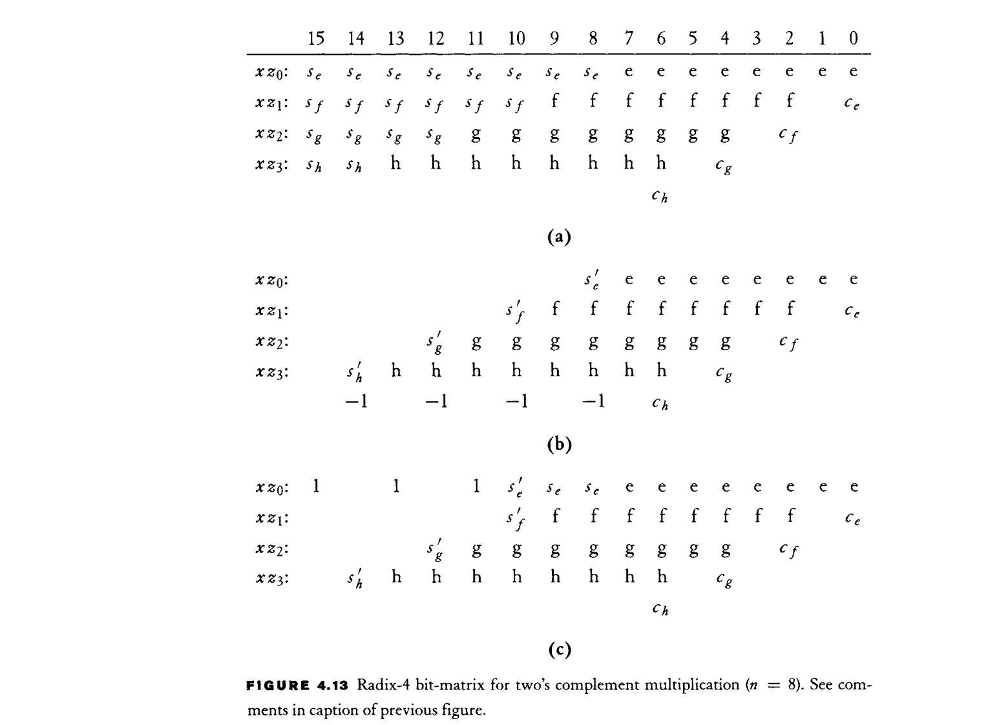
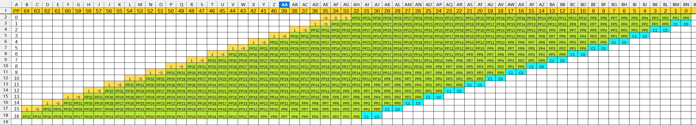

# 32位乘法器设计

radix-4 booth编码 + wallace树

## Radix-4 Booth 编码

部分和的符号处理参考 《Digital Arithmetic》(Ercegovac), Chapter 4.2.1 中的做法。

32位的**乘数**可以是**有符号数**或**无符号数**，统一扩展为34-bit有符号数处理。输出17个部分和（Partial Product）。

由于存在符号位扩展和移位，32位**被乘数**的部分和为34位，其中第bit[33]为符号位。

